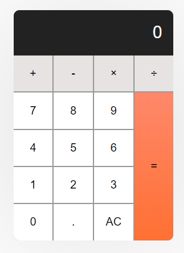

## Dev Front End (React) - Gama Academy

### Projeto Calculadora

Nesse projeto, o desafio era criar uma calculadora utilizando apenas HTML, CSS e Javascript de forma introdutória, trabalhando e manipulando o DOM.

### Foram utilizadas as sequintes ferramentas:

- [HTML básico](https://developer.mozilla.org/pt-BR/docs/Learn/HTML/Introduction_to_HTML/Getting_started)
- [CSS básico](https://developer.mozilla.org/pt-BR/docs/Learn/CSS/First_steps/Getting_started)
- [Javascript básico](https://developer.mozilla.org/pt-BR/docs/Web/JavaScript/Guide/Introduction)
- [Base](https://www.freecodecamp.org/portuguese/news/como-construir-uma-calculadora-html-do-zero-usando-javascript/)

### Acesse o link abaixo para usá-lo

- [Calculadora](https://tiagoss-cubos.github.io/calculator-gama-academy/)

### Implementações futuras:

- [Refazer o projeto com o ReactJS](https://pt-br.reactjs.org/docs/getting-started.html#learn-react)
